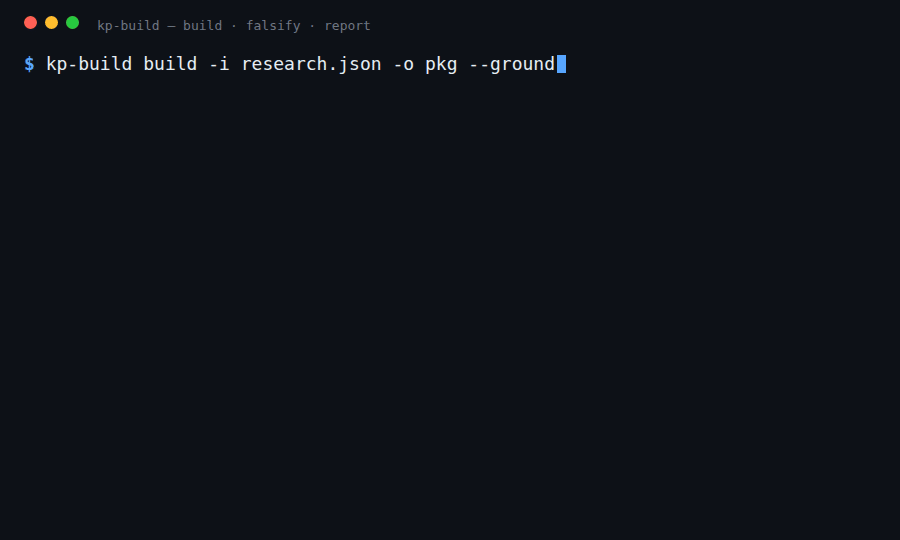

# kp-build — citation-verified knowledge packages for agents

[](https://github.com/Treibs/kp-build/actions/workflows/ci.yml)
[](https://pypi.org/project/kp-build/)
[](LICENSE)

**📖 [Read the overview →](https://treibs.github.io/kp-build/kp-build-overview.html)** — what it is, the sleep example, and how it works, in two minutes.

An LLM agent working on a niche or recent topic burns compute reconstructing the field from scratch
every time — and routinely cites papers that don't exist. **kp-build builds that foundation once:** a
small, verified knowledge package an agent loads to actually *know* a narrow research area — deep enough
to write the related-work section of a paper on it — with every citation checked live against
arXiv, Crossref, and OpenAlex so none are hallucinated. Build it once, share it, and any agent reuses it instead of
re-paying the research cost.

And when the model already knows the topic, kp-build *tells you* — it won't sell you a package that
doesn't help.



**What's in a package** (a small directory):

- **verified citation spine** — the real papers, each checked against arXiv / Crossref / OpenAlex (no fakes)
- **claims** — findings / methods, each tied to a real quoted passage from its paper
- **open-problems register** — the gaps the papers flag as unsolved (where new work goes)
- **debate map** — the contested points, and which papers take which side
- **`CONTEXT.md`** — a small briefing an agent loads to inherit the whole topic in one file

It's a reusable knowledge *asset*, not a one-shot "deep research" report — persistent, structured, and
machine-checkable.

### Knowledge packages & KPM

The unit kp-build produces is a **knowledge package** — a portable, self-contained directory (the verified
spine, grounded claims, open problems, debates, a loadable `CONTEXT.md`, and a machine-readable
`index.json`) that any agent can install and load. It isn't a kp-build-specific format: it's a valid
**KPM** package — `kpm doctor` and `kpm pack` accept it as-is.

**KPM** ([`0xLT/kpm`](https://github.com/0xLT/kpm)) is an open package manager for *knowledge* — think npm,
but a package is verified knowledge instead of code, with `install` / `lock` / `compose` / `pack` / `share`.
kp-build is the **authoring engine** for that ecosystem: it does the research, verification, and authoring;
KPM handles distribution. Every build emits the KPM package contract (`knowledge.json`), so what you build
is shareable through KPM with no separate distribution layer to stand up.

### Why not just a deep-research report, or RAG?

| | deep-research report | RAG over a paper dump | **kp-build** |
|---|---|---|---|
| **citations** | can be hallucinated | only what you indexed | **every cite verified, or dropped** |
| **reuse** | one-shot, per question | per-query retrieval | **built once, loaded by any agent** |
| **honesty** | asserts | asserts | **measures whether it helps — and says when it doesn't** |

> **When it pays off:** topics the model is *weak* on — recent, niche, or post-training-cutoff. On a
> topic the model already knows, a package adds traceability and reuse but not accuracy — and the
> falsification check (below) will say so honestly rather than sell you a hollow win.

## Install

```bash
pip install kp-build                                     # from PyPI — the engine + the `kp-build` CLI
# from source / for development:
pip install git+https://github.com/Treibs/kp-build.git   # latest, straight from the repo
pip install -e '.[dev]'                                  # from a clone, with the test suite
```

Python ≥ 3.10. Runtime deps: `pyyaml`, `pydantic`. Citation verification hits the public arXiv,
Crossref, and OpenAlex APIs (no keys, no cost).

## Use with Claude Code

kp-build has two halves: the **engine** (the `kp-build` CLI, above) and the **`/kp-build` skill**
(`skill/SKILL.md`) — the orchestration spec that drives the research subagents which produce a
`research.json` for the engine to verify and assemble.

The easiest way in: **paste this repo's URL to Claude Code and ask it to set up kp-build.** Everything
it needs is here. Or do it by hand:

```bash
# 1. the engine
pip install kp-build

# 2. the skill (so `/kp-build` is available in Claude Code)
mkdir -p ~/.claude/skills/kp-build
curl -sL https://raw.githubusercontent.com/Treibs/kp-build/master/skill/SKILL.md \
  -o ~/.claude/skills/kp-build/SKILL.md
```

Then, in Claude Code:

```
/kp-build  the 2024-2026 frontier of <your narrow topic>
```

The skill runs the research wave (you + subagents), the engine does the verification/assembly/scoring,
and you get a citation-verified package plus an honest verdict on whether it beats unaided recall. New
to it? Just ask Claude: *"read skill/SKILL.md and walk me through building a package."*

## Quickstart

`examples/` ships five real packages with their inputs, so you can run the engine end-to-end on a
clean clone. Start with **`sleep-insomnia-evidence`** — an everyday topic ("does X actually help me
sleep?") that shows the whole flow. The engine's input is a `research.json` (papers, claims, open
problems, debates):

```bash
# `build` takes a research.json and writes a package DIRECTORY:
kp-build build -i examples/sleep-insomnia-evidence.research.json -o /tmp/pkg --no-verify   # offline
kp-build build -i examples/sleep-insomnia-evidence.research.json -o /tmp/pkg               # live: verify every citation

# `falsify` and `report` operate on a built package directory — examples/ ships pre-built ones:

# did the package help? score an unaided agent vs a package-loaded one (answers shipped in examples/)
kp-build falsify examples/sleep-insomnia-evidence \
  --question "Evidence-based interventions to improve sleep and treat insomnia in adults" \
  --base examples/sleep-insomnia-evidence.base-answer.txt \
  --kp   examples/sleep-insomnia-evidence.kp-answer.txt

# render a self-contained HTML report (verdict, verified spine, open problems, debates)
kp-build report examples/sleep-insomnia-evidence
```

## How it works

The **`/kp-build` skill** (`skill/SKILL.md`) orchestrates research subagents to gather papers and draft
claims into a `research.json`. The **engine** then does the mechanical, deterministic part — verify,
assemble, ground, lint, score. Two hard gates run at build time:

- **No hallucinated citations.** *The promise:* every shipped paper is real and correctly identified.
  *How:* a citation is `verified` only when an explicit arXiv id or DOI resolves **and** its canonical
  title strictly matches — a "real id, wrong paper" mislabel fails, and a title-only cite can't anchor
  a claim.
- **Grounded passages (`--ground`).** *The promise:* a claim's quote actually appears in the paper it
  cites. *How:* the passage is matched against the arXiv abstract (free) or the paper's ar5iv fulltext
  (arXiv's HTML rendering), marking each claim `grounded`, `unconfirmed`, or `ungrounded`
  (fulltext-checked and absent → flagged).

### Two honesty checks: one before, one after

- **`probe` — *should we even build this?*** (before) Scores one unaided answer from the model. If it
  fabricates, **hedges** (writes placeholder ids like `arXiv:2510.xxxxx` for work it can't recall), or is
  too thin → **BUILD** (the model is weak here, so a package will help). If it already cites cleanly →
  **SKIP** (don't spend the compute).
- **`falsify` — *did it actually help?*** (after) Tries to *disprove* the package's value: it scores a
  package-loaded agent against an unaided one on a held-out task, on **precision** (cites that exist and
  match) and **recall** (coverage of the verified spine). Survive that, and it's a real, recorded win;
  fail, and it says so.

## The example packages

`examples/` ships five real packages built end-to-end (also kept as regression fixtures). Start with the
first — an everyday health question anyone can relate to; the others map what the probe and falsification
check discriminate, and show kp-build works **beyond arXiv** (journal papers verified via Crossref/DOI):

| package | the topic | `probe` | did it help? |
|---|---|---|---|
| **`sleep-insomnia-evidence`** ⭐ | **everyday health** — what actually improves sleep, evidence vs hype | SKIP\* (under-fired) | **yes** — base *fabricated* a study + missed ¾ of the evidence; f1 0.40 → 0.85 |
| `discrete-diffusion-llms` | model **fabricates** cites (recent ML) | BUILD | **yes** — fixes mislabeled cites (precision **0.62→1.00**) **and** coverage; f1 0.37 → 0.91 |
| `speculative-decoding-llms` | model **knows it cold** | SKIP | only on coverage — precision was already perfect |
| `rubric-based-rl-nonverifiable` | model **hedges** (post-cutoff 2026) | BUILD | **yes** — spine coverage 0.07 → 1.00 |
| `glp1-incretin-obesity` | **biomedical** (non-arXiv, Crossref/DOI) | SKIP | on coverage — recall 0.26 → 0.95 with verifiable DOIs |

\* **The probe under-fired on sleep — and that's the point.** The probe is a cheap *precision-only*
pre-screen; the model cited sleep cleanly enough to pass it (9 of 10 real). But it still *fabricated*
one citation (`10.5665/sleep.6072` — doesn't exist) and missed most of the evidence — and you can't tell
which of its confident claims are real without checking. The recall-aware **falsify** caught the gap the
probe missed. (Same probe blind spot the rubric-RL example documents, here on an everyday topic.)

Each is also a public, installable **KPM package** — load one into any agent's vault with
`kpm add github:Treibs/kp-<slug>#v0.1.0` (e.g. the flagship
[`kp-sleep-insomnia-evidence`](https://github.com/Treibs/kp-sleep-insomnia-evidence)).
See [`examples/README.md`](examples/README.md) for the full story on each — including how the rubric-RL
example exposed, and drove a fix for, a blind spot in the probe.

## Sharing a package through KPM

Because every build emits the KPM contract (see [Knowledge packages & KPM](#knowledge-packages--kpm)
above), "build once, share" is just the existing KPM CLI — no extra steps. (KPM is a separate tool, not
installed by `pip install kp-build`; get it from [`0xLT/kpm`](https://github.com/0xLT/kpm).)

```bash
kp-build build -i research.json -o ./pkg        # produces a valid kpm package
cd ./pkg && kpm doctor && kpm pack              # validate + write a shareable .tgz
# publish ./pkg as a tagged repo; any consumer then:
kpm add github:<owner>/<repo>#v0.1.0 && kpm compose   # inherits CONTEXT.md — no re-research
```

## Layout

```
src/kp_build/      the engine (scope→survey→extract→verify→ground→assemble→falsify→report)
skill/SKILL.md     the /kp-build orchestration spec (drives the research subagents)
examples/          five real built packages + their research.json inputs and falsification evidence
docs/              explainer / metrics / orchestration (HTML)
SPEC.md            the package format + pipeline, in full
```

## Good to know

- **Confidence is corpus-relative.** A claim's confidence is conditional on its sources being right; the
  package says so, rather than asserting absolute truth.
- **Coverage is scope-relative** and can be too shallow; citation-graph expansion (following papers'
  references and citations to catch what keyword search misses) mitigates it, and the manifest records
  what was searched so the gap stays honest.
- A package is stale the day its field moves; the manifest carries its `built` date, and a re-run is a diff.

See [`SPEC.md`](SPEC.md) for the complete package format, schema, and pipeline.

## License

MIT — see [`LICENSE`](LICENSE). (Knowledge packages the tool *produces* default to CC-BY-4.0, set in each
package's `knowledge.json` and publisher-overridable.)
